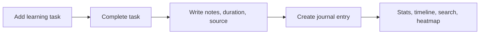

# Learning Journal

[简体中文](./README.md) | English

> A local-first learning task board and daily learning journal. Plan what you want to learn, complete it, then turn it into searchable notes with time tracking, tags, categories, heatmaps, and stats.


## Why

Most learning trackers ask you to write what you already learned. In real life, learning usually starts as a plan:

1. I want to learn something.
2. I finish it later.
3. I record what I actually learned, how long it took, and where the source was.

Learning Journal follows that workflow. It helps you turn learning intentions into completed notes, searchable history, and visible progress.

## Features

- **Learning Tasks**  
  Add what you plan to learn with category and tags. When done, complete it with notes, duration, and source URL.

- **Journal Entries**  
  Completed tasks become searchable learning entries with markdown notes.

- **Daily Summary**  
  Write an independent summary for any date, separate from tasks and entries.

- **Dashboard**  
  Weekly/monthly/all-time learning stats, streak counter, recent entries, tag cloud, category chart, and heatmap.

- **Monthly Heatmap**  
  Shows the current month by default. You can switch to previous or future months and hover a day to see what you learned.

- **Timeline**  
  Browse learning entries grouped by date.

- **Search**  
  Search by keyword, category, tag, and date range.

- **Category & Tag Management**  
  Create, rename, delete categories and tags. Categories support custom colors.

- **Local-first**  
  Runs on your own machine. No cloud, no login, no tracking.

- **Dark Mode**  
  System-aware theme with manual toggle.

- **Language Switcher**  
  Built-in Chinese and English UI.

- **One-click Start**  
  Windows `.vbs` scripts can start and stop the dev server silently.

## Tech Stack

- Frontend: React 18, Vite, TypeScript, Tailwind CSS
- Backend: Node.js, Express, TypeScript
- Database: SQLite via `better-sqlite3`
- State/data: TanStack Query
- UI: custom shadcn-style components, Lucide icons, Recharts, Framer Motion

## Quick Start

```bash
npm install
npm run dev
```

Open:

- Client: http://localhost:5173
- API: http://localhost:3001

The SQLite database is created automatically at:

```text
server/data/learning-journal.sqlite
```

## Windows One-click Launch

From the project parent folder:

```text
Start Learning Journal Silent.vbs
Stop Learning Journal Silent.vbs
```

Inside the project folder:

```text
start-learning-journal-silent.vbs
stop-learning-journal-silent.vbs
```

The silent start script runs `npm run dev` in the background and opens:

```text
http://127.0.0.1:5173/
```

## Workflow



## Scripts

```bash
npm run dev        # Start client and server
npm run build      # Build server and client
npm run typecheck  # Run TypeScript checks
npm run start      # Start built server
```

## Project Structure

```text
learning-journal/
├── client/                 # React + Vite frontend
├── server/                 # Express + SQLite backend
│   └── data/               # Local SQLite database, ignored by git
├── package.json            # Workspace scripts
└── README.md
```

## Database Tables

- `tasks` - learning todos before they become records
- `entries` - completed learning journal entries
- `daily_summaries` - independent daily summaries
- `categories` - category names and colors
- `tags` - reusable tag names

## API

All responses use a consistent shape:

```json
{ "success": true, "data": {} }
```

or:

```json
{ "success": false, "error": "Message" }
```

### Entries

- `GET /api/entries`
- `GET /api/entries/:id`
- `POST /api/entries`
- `PUT /api/entries/:id`
- `DELETE /api/entries/:id`
- `GET /api/entries/dates`

### Tasks

- `GET /api/tasks`
- `POST /api/tasks`
- `PUT /api/tasks/:id`
- `PUT /api/tasks/:id/status`
- `POST /api/tasks/:id/complete`
- `DELETE /api/tasks/:id`

### Daily Summaries

- `GET /api/daily-summaries`
- `GET /api/daily-summaries/:date`
- `PUT /api/daily-summaries/:date`
- `DELETE /api/daily-summaries/:date`

### Stats

- `GET /api/stats`
- `GET /api/stats?month=2026-06`

### Categories

- `GET /api/categories`
- `POST /api/categories`
- `PUT /api/categories/:name`
- `DELETE /api/categories/:name`

### Tags

- `GET /api/tags`
- `POST /api/tags`
- `PUT /api/tags/:name`
- `DELETE /api/tags/:name`

## Privacy

This app is designed for personal use:

- No cloud dependency
- No account system
- No telemetry
- SQLite database stays local
- `server/data/*.sqlite` is ignored by git

## Roadmap

- Export entries to Markdown
- Import/export backup file
- Calendar view
- Pomodoro-style timer for active learning tasks
- GitHub-style yearly heatmap
- More chart filters

## License

MIT
