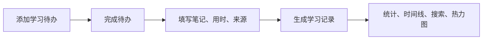

# Learning Journal

简体中文 | [English](./README.en.md)

> 一个本地优先的学习待办与学习日志应用。先计划你要学什么，完成后再填写笔记、用时和来源链接，最终沉淀为可搜索、可统计、可回顾的学习记录。


## 为什么做这个项目

很多学习记录工具都是“事后记录”：今天学了什么、学了多久、记了什么笔记。

但真实的学习流程通常是：

1. 我先有一个想学或必须完成的内容。
2. 之后我去学习和完成它。
3. 完成后再记录实际学到的东西、学习时长和资料来源。

Learning Journal 按照这个流程设计，帮助你把学习计划变成学习记录，把零散学习变成可回顾的成长轨迹。

## 功能特性

- **学习待办**  
  先写下你准备学什么，只需要选择分类和标签。完成后再补充笔记、用时和来源链接。

- **学习记录**  
  完成待办后会自动生成正式学习记录，支持 Markdown 笔记。

- **每日小结**  
  可以为任意日期写独立小结，不再混在待办或学习记录里。

- **仪表盘**  
  展示本周、本月、总学习时长，当前连续学习天数，最近记录，标签云，分类图表和学习热力图。

- **按月学习热力图**  
  默认显示当前月份，也可以切换到之前或之后的月份。鼠标悬停可以看到当天学了什么。

- **时间线**  
  按日期分组浏览所有学习记录。

- **搜索与筛选**  
  支持关键词、分类、标签和日期范围筛选。

- **分类与标签管理**  
  支持新增、重命名、删除分类和标签。分类支持自定义颜色。

- **本地优先**  
  所有数据都保存在你自己的电脑里，不依赖云服务，不需要登录账号。

- **深色模式**  
  支持跟随系统主题，也可以手动切换。

- **中英文界面**  
  应用内置中英文切换。

- **一键启动**  
  Windows 下提供静默启动和停止脚本。

## 技术栈

- 前端：React 18、Vite、TypeScript、Tailwind CSS
- 后端：Node.js、Express、TypeScript
- 数据库：SQLite、better-sqlite3
- 数据请求与缓存：TanStack Query
- UI：shadcn 风格组件、Lucide icons、Recharts、Framer Motion

## 快速开始

```bash
npm install
npm run dev
```

打开：

- 前端：http://localhost:5173
- 后端 API：http://localhost:3001

SQLite 数据库会自动创建在：

```text
server/data/learning-journal.sqlite
```

## Windows 一键启动

在项目上级目录可以使用：

```text
Start Learning Journal Silent.vbs
Stop Learning Journal Silent.vbs
```

在项目目录内可以使用：

```text
start-learning-journal-silent.vbs
stop-learning-journal-silent.vbs
```

静默启动脚本会在后台运行 `npm run dev`，然后自动打开：

```text
http://127.0.0.1:5173/
```

## 使用流程



## 常用脚本

```bash
npm run dev        # 启动前端和后端
npm run build      # 构建前端和后端
npm run typecheck  # TypeScript 类型检查
npm run start      # 启动构建后的服务
```

## 项目结构

```text
learning-journal/
├── client/                 # React + Vite 前端
├── server/                 # Express + SQLite 后端
│   └── data/               # 本地 SQLite 数据库，已被 git 忽略
├── package.json            # 工作区脚本
└── README.md
```

## 数据库表

- `tasks`：学习待办，完成后可转为正式记录
- `entries`：正式学习记录
- `daily_summaries`：每日小结
- `categories`：分类名称和颜色
- `tags`：可复用标签

## API

所有接口响应都使用统一格式：

```json
{ "success": true, "data": {} }
```

或者：

```json
{ "success": false, "error": "Message" }
```

### 学习记录

- `GET /api/entries`
- `GET /api/entries/:id`
- `POST /api/entries`
- `PUT /api/entries/:id`
- `DELETE /api/entries/:id`
- `GET /api/entries/dates`

### 学习待办

- `GET /api/tasks`
- `POST /api/tasks`
- `PUT /api/tasks/:id`
- `PUT /api/tasks/:id/status`
- `POST /api/tasks/:id/complete`
- `DELETE /api/tasks/:id`

### 每日小结

- `GET /api/daily-summaries`
- `GET /api/daily-summaries/:date`
- `PUT /api/daily-summaries/:date`
- `DELETE /api/daily-summaries/:date`

### 统计

- `GET /api/stats`
- `GET /api/stats?month=2026-06`

### 分类

- `GET /api/categories`
- `POST /api/categories`
- `PUT /api/categories/:name`
- `DELETE /api/categories/:name`

### 标签

- `GET /api/tags`
- `POST /api/tags`
- `PUT /api/tags/:name`
- `DELETE /api/tags/:name`

## 隐私说明

这个应用面向个人本地使用：

- 不依赖云服务
- 不需要账号系统
- 没有埋点或遥测
- SQLite 数据库只保存在本地
- `server/data/*.sqlite` 已加入 `.gitignore`

## 路线图

- 导出学习记录为 Markdown
- 备份文件导入/导出
- 日历视图
- 学习任务番茄钟
- 年度 GitHub 风格热力图
- 更多统计筛选条件

## 许可证

MIT
